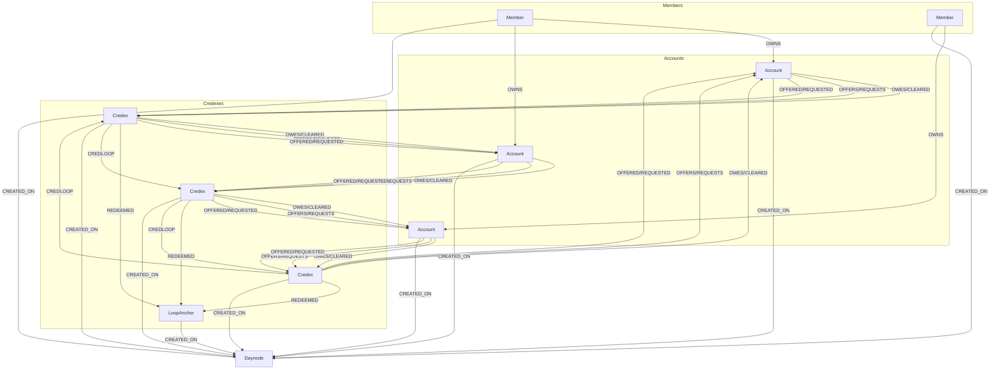
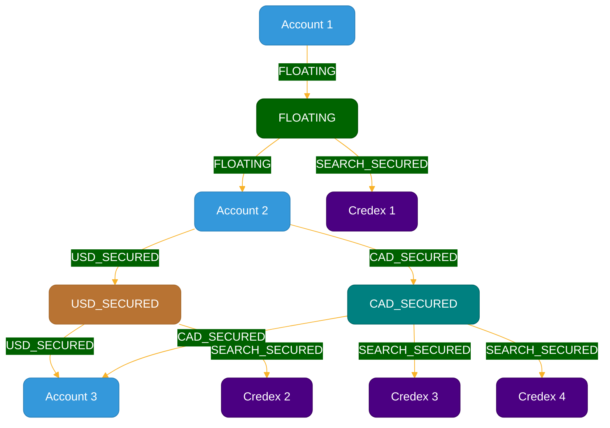

# Credex Ecosystem Core API

The codebase in this credex-core repository actualizes two principles:

## Credex Principle

**If I owe you,**\
**and you owe them,**\
**and they owe me,**\
**we're square.**

## Credcoin Principle

**Every human is entitled to one equal share of the value of the natural wealth entering the organic economy.**\
**Every human is responsible to provide value equal to the amount of natural wealth that they consume.**

# Overview

The credex ecosystem actualizes the Credex Principle in the Minute Transaction Queue (MTQ), which tracks payable and receivable invoices for members' accounts, finds loops of value creation, and cancels payable and receivable invoices against each other in "credloops" in which every debt is reduced by an equal value. This is a GAAP-compliant accounting process that any person and any business can benefit from.

The ecosystem actualizes the Credcoin Principle in the Daily Credcoin Offering (DCO), which updates exchange rates across the ecosystem daily. Every 24h, the DCO makes this equation true: one credcoin today equals the number of members participating in the DCO today divided by the value of natural wealth entering the organic economy through the DCO today.

The organic economy is a subset of the credex ecosystem, which is a subset of the global economy, which is the human-enhanced subset of the world that is given to us by nature. The organic economy is an economy in which wealth circulates, profit accumulates, investment is made, and gifts are given in alignment and long-term harmony with the biological environment of our habitat and the physical laws that bind us.

The value of the natural wealth processed by the DCO is split into two portions: gift portion and market portion. Currently, in the mvp version we've developed in this repository, only the gift portion of the DCO is implemented. The market portion will be added later.

The credex ecosystem stores values in credcoin (CXX). In order to natively enable multi-denominational accounting, a CXXmultiplier value is stored alongside every CXX value. Both of these values are updated in every DCO so that the credex remains true to the face value in the denomination specified, and to other values stored in the ecosystem. A value expressed in CXX represents that value in relationship to every other value stored in the ecosystem. A value in CXX divided by its CXX multiplier expresses the value in the chosen denomination (face value).

The system manages the balance between local truth (preserving the face value of contracts in their specified denomination) and global truth (adjusting all values relative to credcoin) through the daily rate and value adjustments in the DCO. This implementation creates a robust ecosystem that manages accounting processes across any denomination, clears debts automatically, and adjusts values dynamically.

## express.js server

The express.js server is initialized with index.ts, which provides the cronjobs and endpoints that power the ecosystem and enable members and client apps to interact with its ledger.

## cronjobs

The Core module hosts the cronjobs.

DailyCredcoinOffering() runs every day at midnight UTC. First, DBinitialization() is run if there is no active daynode in the database. DCOexecute() then runs the Daily Credcoin Offering.

MinuteTransactionQueue() runs every minute, clearing credloops of value creation across the ecosystem.

## endpoints

Controllers for the endpoints are imported, and endpoints created for the various modules: Member, Account, Avatar, Admin, and DevAdmin.

# Daily Credcoin Offering (DCO)

Runs every 24h at midnight UTC, while most of the world's population centres are in darkness.

## DBinitialize.ts

The DBinitialization file sets up the initial state of the database for the Credex ecosystem.

1. Sets up database constraints and indexes for various entities (Daynode, Member, Account).
2. Establishes "day zero" and initializes exchange rates for various currencies against CXX (Credcoin).
3. Creates an initial "daynode" with the day zero exchange rates.
4. Creates an initial member (Ryan Watson) and updates their member tier.
5. Creates several initial accounts:
   - Ryan Watson's personal account
   - Credex Foundation account
   - Great Sun Financial (business account)
   - VimbisoPay (business account)
6. Establishes relationships between these accounts, particularly marking some as "CREDEX_FOUNDATION_AUDITED" to determine which accounts can originally issue secured credexes.
7. Creates an initial Credex transaction to fund the DCO for a year.

This initialization process sets up the basic structure and relationships needed for the Credex ecosystem to function, including the establishment of exchange rates and the creation of foundational accounts and transactions.

## DCOexecute.ts

The DCOexecute function implements the Daily Credcoin Offering (DCO) process.

1. Check if the Minute Transaction Queue (MTQ) is running and wait if it is and retry in a few seconds.
2. Set the DCOrunningNow flag and fetch the current and next date.
3. Perform an end-of-day backup.
4. Process defaulting unsecured credexes and expire pending offers/requests.
5. Fetch current exchange rates for various currencies.
6. Fetch declared DCO participants and filter them based on available secured balance.
7. Calculate new CXX (Credcoin) rates based on the total DCO amount and number of participants.
8. Create a new daynode with the updated CXX rates.
9. Create DCO give transactions from participants to the Credex Foundation.
10. Update credex and asset balances across the system to reflect the new exchange rates.
11. Create DCO receive transactions from the Credex Foundation to participants.
12. Perform a start-of-day backup for the new day.

This process implements the Credcoin Principle by:

- Allowing participants to contribute value to the ecosystem (DCO give transactions).
- Distributing an equal share of the new value to all participants (DCO receive transactions).
- Adjusting the value of Credcoin relative to other currencies based on the total contribution and number of participants.
- Updating all existing balances and transactions to maintain their relative value in the new exchange rate environment.

The DCO process ensures that the value of one Credcoin is always equal to the number of participants divided by the value of natural wealth entering the organic economy through the DCO, as stated in the Credcoin Principle.

This implementation allows for a dynamic, daily adjustment of the ecosystem's internal economy, reflecting the contributions and participation of its members while maintaining the relative value of existing transactions and balances.

# MinuteTransactionQueue (MTQ)

The Minute Transaction Queue is a crucial part of the Credex ecosystem that runs every minute. It links the main ledgerSpace database (the source of truth and full information) to a searchSpace database (optimized to find credloops). New accounts are first added to the searchSpace, then new credexes. After each new credex is added, the ecosystem finds and clears all possible loops created by the new credex.

1. Processing new accounts:

   - Finds accounts with "PENDING_ACCOUNT" status in the ledger space.
   - Creates corresponding accounts in the search space.
   - Updates the account status to "PROCESSED" in the ledger space.

2. Processing new Credexes:
   - Retrieves Credexes with "PENDING_CREDEX" status from the ledger space.
   - Sorts them by acceptance time.
   - For each Credex, it calls the LoopFinder function.

## LoopFinder.ts

Checks if the credex already exists in the search space. If not, it creates it.

1. Finds all loops starting and ending at the specified account.
   - Identifies the loop with the earliest due date.
   - For each node in the loop, it selects the Credex with the earliest due date (or largest amount if tied).
   - Identifies the minimum outstanding amount among all credexes in the loop.
2. If a loop is found:
   - Subtract the minimum amount from all Credexes in the loop.
   - Update the searchSpace, removing fully redeemed credexes and updating the earliest due dates.
   - Update the ledgerSpace, creating a LoopAnchor to represent the cleared loop, update the Credexes' outstanding and redeemed amounts, and create REDEEMED and CREDLOOP relationships.
   - For fully redeemed credexes, replace the OWES relationships with CLEARED relationships in ledgerSpace.
3. Go back to step one until no loop is found.
4. Once no more loops can be found, mark the original Credex as processed and exit the loop.

This implementation actualizes the Credex Principle by finding loops where "If I owe you, and you owe them, and they owe me, we're square." It automatically clears these loops, reducing the outstanding amounts of all involved credexes by the same amount (the minimum amount in the loop).

The LoopFinder is called by the MinuteTransactionQueue for each new Credex, ensuring that loops are found and cleared as soon as possible after new Credexes are created.

# Member

This module handles member-related operations in the Credex ecosystem. It exposes the following endpoints:

1. **onboardMember** (POST)

   - Function: Registers a new member in the Credex ecosystem and creates their personal consumption account.
   - Required variables:
     - firstname: string
     - lastname: string
     - phone: string
   - Optional variables:
     - DCOgiveInCXX: number (for setting up the DCO contribution)
     - DCOdenom: string (denomination for DCO contribution)

2. **getMemberDashboardByPhone** (GET)

   - Function: Retrieves a member's dashboard information and associated account dashboards using their phone number.
   - Required variables:
     - phone: string

3. **getMemberByHandle** (GET)

   - Function: Retrieves member information using their unique handle.
   - Required variables:
     - memberHandle: string

4. **updateMemberTier** (POST)

   - Function: Updates a member's tier status.
   - Required variables:
     - memberID: string
     - newTier: number

5. **securedCredexAuthForTier** (POST)
   - Function: Authorizes secured credex for a member's tier.
   - Required variables:
     - issuerAccountID: string
     - amount: number
     - denom: string

These endpoints allow for member registration, information retrieval, tier management, and secured credex authorization within the Credex ecosystem. All controllers now include improved input validation, error handling, and logging for better reliability and maintainability.

# Account

This module handles account-related operations in the Credex ecosystem. It exposes the following endpoints:

1. **createAccount** (POST)

   - Function: Creates a new account in the Credex ecosystem.
   - Required variables:
     - ownerID: string
     - accountType: string
     - accountName: string
     - accountHandle: string
     - defaultDenom: string
   - Optional variables:
     - DCOgiveInCXX: number
     - DCOdenom: string

2. **getAccountByHandle** (GET)

   - Function: Retrieves account information using the account handle.
   - Required variables:
     - accountHandle: string

3. **updateAccount** (PATCH)

   - Function: Updates an existing account's information.
   - Required variables:
     - ownerID: string
     - accountID: string
   - Optional variables:
     - accountName: string
     - accountHandle: string
     - defaultDenom: string

4. **authorizeForAccount** (POST)

   - Function: Authorizes a member to perform actions on behalf of an account.
   - Required variables:
     - memberHandleToBeAuthorized: string
     - accountID: string
     - ownerID: string

5. **unauthorizeForAccount** (POST)

   - Function: Removes authorization for a member to act on behalf of an account.
   - Required variables:
     - memberIDtoBeUnauthorized: string
     - accountID: string
     - ownerID: string

6. **updateSendOffersTo** (POST)
   - Function: Updates the account's preference for receiving offers.
   - Required variables:
     - memberIDtoSendOffers: string
     - accountID: string
     - ownerID: string

These endpoints provide comprehensive account management capabilities within the Credex ecosystem. All controllers now include improved input validation, error handling, and logging for better reliability and maintainability. The controllers ensure that all calls to Account services go through them, enforcing proper access control and data validation.

# Credex

This module handles Credex-related operations in the Credex ecosystem. It exposes the following endpoints:

1. **offerCredex** (POST)

   - Function: Creates a new Credex offer.
   - Required variables:
     - memberID: string
     - issuerAccountID: string
     - receiverAccountID: string
     - Denomination: string
     - InitialAmount: number

2. **acceptCredex** (PUT)

   - Function: Accepts a Credex offer.
   - Required variables:
     - credexID: string
     - signerID: string

3. **acceptCredexBulk** (PUT)

   - Function: Accepts multiple Credex offers in bulk.
   - Required variables:
     - credexIDs: string[] (Array of credex IDs to accept)
     - signerID: string

4. **declineCredex** (PUT)

   - Function: Declines a Credex offer.
   - Required variables:
     - credexID: string

5. **cancelCredex** (PUT)

   - Function: Cancels a Credex offer.
   - Required variables:
     - credexID: string

6. **getCredex** (GET)

   - Function: Retrieves information about a specific Credex.
   - Required variables:
     - credexID: string
     - accountID: string

7. **getLedger** (GET)
   - Function: Retrieves ledger information for an account.
   - Required variables:
     - accountID: string
   - Optional variables:
     - numRows: number
     - startRow: number

These endpoints provide comprehensive Credex management capabilities within the ecosystem. The offerCredex endpoint allows for the creation of new Credex offers, while acceptCredex and acceptCredexBulk facilitate the acceptance of these offers individually or in bulk. The declineCredex and cancelCredex endpoints provide options for rejecting or withdrawing Credex offers. The getCredex endpoint allows for retrieving detailed information about a specific Credex, and getLedger provides access to an account's transaction history. Together, these endpoints enable the full lifecycle management of Credexes within the ecosystem, from creation and acceptance to cancellation and historical tracking.

# Avatar

This module handles operations related to Avatars in the Credex ecosystem. Avatars are nodes that members can delegate signing authority to. Currently, the only Avatar implemented is a Recurring transaction. Once this Avatar is signed by the counterparties, it activates on the schedule agreed by the counterparties to create a Credex using the data agreed between the counterparties. The trail of accountability is maintained because the creation of an Avatar must be signed by the counterparties, and the Avatar signs every Credex it creates.

The Avatar module exposes the following endpoints:

1. **requestRecurring** (POST)

   - Function: Creates a new recurring transaction request.
   - Required variables:
     - signerMemberID: string
     - requestorAccountID: string
     - counterpartyAccountID: string
     - InitialAmount: number
     - Denomination: string
     - nextPayDate: string
     - daysBetweenPays: number
   - Optional variables:
     - securedCredex: boolean
     - credspan: number
     - remainingPays: number
   - Requires either securedCredex = true or a credspan between 7 and 35.
   - remainingPays is set when the avatar will run a specific number of times before completion, and not set when the avatar is to continue indefinitely.

2. **acceptRecurring** (POST)

   - Function: Accepts a recurring transaction request.
   - Required variables:
     - avatarID: string
     - signerID: string

3. **cancelRecurring** (POST)
   - Function: Cancels an active recurring transaction or declines a pending request.
   - Required variables:
     - signerID: string
     - cancelerAccountID: string
     - avatarID: string

These endpoints provide functionality for managing recurring transactions within the Credex ecosystem:

- The requestRecurring endpoint allows for the creation of new recurring transaction requests. It sets up the details of the recurring transaction, including the accounts involved, the amount, denomination, frequency, and duration.

- The acceptRecurring endpoint facilitates the acceptance of these requests. When a recurring transaction is accepted, it becomes active and will automatically create Credex transactions according to the specified schedule.

- The cancelRecurring endpoint enables the cancellation of an active recurring transaction or the declination of a pending request. This provides flexibility for users to modify or end recurring arrangements as needed.

The Avatar module enhances the automation and flexibility of transactions within the Credex ecosystem by allowing members to set up recurring transactions. This feature is particularly useful for regular payments, subscriptions, or any other scenario where periodic transactions are required. The implementation maintains accountability by requiring explicit acceptance of recurring transaction requests and allowing for their cancellation at any time.

# Admin

This module is coming soon.

# DevAdmin

This module is under construction.

# To run the credex ecosystem in your local dev environment

### Prerequisites

Before running this project, make sure you have the following installed:

- Node.js (version 18.X.X or higher)
- npm (version X.X.X or higher)

### Installation

1. Clone the repository:

   ```bash
   git clone https://github.com/Credex/credex-core.git
   ```

2. Navigate to the project directory:

   ```bash
   cd credex-core
   ```

   Create a branch from the 'dev' branch.

3. Install the dependencies:

   ```bash
   npm install
   ```

### Running the Project

To run the project using nodemon, follow these steps:

1. Install nodemon globally (if not already installed):

   ```bash
   npm install -g nodemon
   ```

   This will install nodemon globally on your system.

2. Open a terminal and navigate to the project directory.

3. Run the following command:

   ```bash
   npm run nodemon
   ```

   This command will start the project using nodemon, which will automatically restart the server whenever changes are made to the code.

4. Open postman and visit `http://localhost:5000` to access the project endpoints.

# To run on a Codespaces virtual machine

### Prerequisites and installation

Executed automatically via devcontainer.

### Start the development server

```bash
npm run nodemon
```

This command will start the project using nodemon, which will automatically restart the server whenever changes are made to the code.

### Use Postman for endpoints

1. Click the icon for the Postman extension in the sidebar and sign in. You may need to use the authorization token provided by Postman. Open the Credex Team Workspace.

2. In the codespaces terminal, print the Github Token with

```
echo $GITHUB_TOKEN
```

Copy the token and paste it the "X-Github-Token" field in the credex-core variables in Postman. A new token is created every codespae session. If the codespace stops, this step has to be completed again.

3. After `npm run nodemon`, copy the forwarded port address from the Ports tab and paste it in the "base_url" field in the credex-core variables in Postman. This url will remain constant for this specific codespace, even across multiple sessions.

The github token and base_url are currently saved globally in Postman, so if multiple people are working at the same time, we'll need to update Postman to handle that.

# ledgerSpace schema



\*\* relationship names separated by "/" indicates that only one of those relationship types can exist between the two nodes.

## Node Properties

### Member

- memberID: string
- memberHandle: string
- firstname: string
- lastname: string
- phone: string
- email: string
- memberTier: number

### Account

- accountID: string
- accountHandle: string
- accountName: string
- accountType: string
- DCOgiveInCXX: number
- DCOdenom: string
- queueStatus: string

### Credex

- credexID: string
- InitialAmount: number
- OutstandingAmount: number
- RedeemedAmount: number
- DefaultedAmount: number
- WrittenOffAmount: number
- Denomination: string
- CXXmultiplier: number
- credexType: string
- dueDate: Date
- DateRedeemed: Date
- queueStatus: string

### LoopAnchor

- loopID: string
- loopedAt: DateTime
- LoopedAmount: number
- CXXmultiplier: number
- Denomination: string

### Daynode

- Date: Date
- Active: boolean
- DCOrunningNow: boolean
- MTQrunningNow: boolean
- CXXprior_CXXcurrent: number
- CXX: number
- USD: number
- CAD: number
- ZiG: number

## Relationship Properties

### OWNS

- (No properties)

### OWES/CLEARED

- (No properties)

### OFFERS/REQUESTS

- (No properties)

### OFFERED/REQUESTED

- (No properties)

### REDEEMED

- AmountRedeemed: number
- AmountOutstandingNow: number
- Denomination: string
- CXXmultiplier: number
- createdAt: DateTime
- redeemedRelID: string

### CREDLOOP

- AmountRedeemed: number
- AmountOutstandingNow: number
- Denomination: string
- CXXmultiplier: number
- createdAt: DateTime
- loopID: string
- credloopRelID: string

### CREATED_ON

- (No properties)

### CREATED_ON

- (No properties)

# searchSpace schema

The SearchSpace schema represents a simplified and optimized version of the ledger space, designed for efficient loop finding in the Credex ecosystem. This schema is optimized to facilitate the resource-efficient identification of credloops for the Minute Transaction Queue (MTQ) process.



## Node properties

### Account

- accountID: string
- accountName: string

### SearchAnchor

- searchAnchorID: string
- earliestDueDate: Date

### Credex

- credexID: string
- outstandingAmount: number
- Denomination: string
- CXXmultiplier: number
- dueDate: Date

## Relationship Properties

### FLOATING

- (No properties)

### USD_SECURED, CAD_SECURED

- (No properties)

### SEARCH_SECURED

- (No properties)

## Explanation

1. **Accounts**: Represented by blue nodes, these are simplified versions of the accounts in the ledger space. They contain only essential information needed for loop finding.

2. **SearchAnchors**: These nodes come in three types:

   - FLOATING (dark green): Represent unsecured credit relationships between accounts.
   - USD_SECURED (copper): Represent secured credit relationships in USD.
   - CAD_SECURED (teal): Represent secured credit relationships in CAD.

3. **Credexes**: Shown as dark purple nodes, these represent individual credit transactions in the system.

4. **Relationships**:
   - FLOATING (dark green): Connects accounts to floating SearchAnchors, representing unsecured credit relationships.
   - USD_SECURED (copper): Connect accounts to USD_SECURED SearchAnchors, representing secured credit relationships in USD.
   - CAD_SECURED (teal): Connect accounts to CAD_SECURED SearchAnchors, representing secured credit relationships in CAD.
   - SEARCH_SECURED (dark purple): Links SearchAnchors to Credexes, allowing for efficient traversal during loop finding.

This optimized structure allows the Minute Transaction Queue to quickly identify potential credit loops by traversing the relationships between Accounts, SearchAnchors, and Credexes. The use of SearchAnchors as intermediary nodes between Accounts and Credexes significantly reduces the complexity of loop finding algorithms, enabling faster processing of transactions in the Credex ecosystem.
