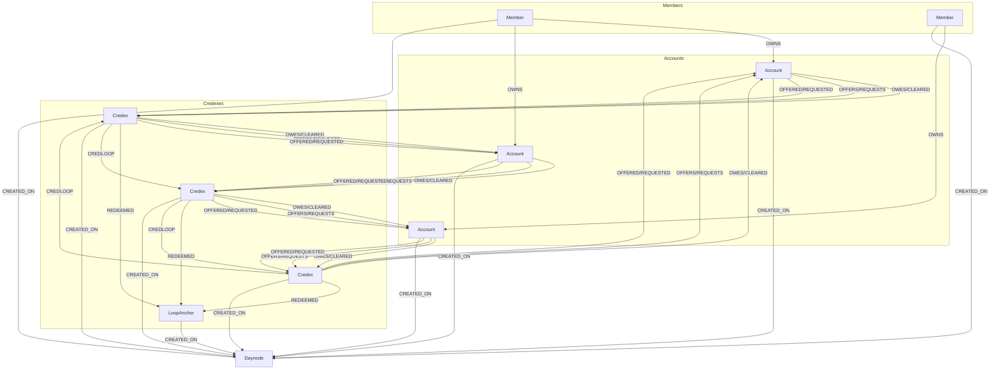

# ledgerSpace schema

\*\* relationship names separated by "/" indicates that only one of those relationship types can exist between the two nodes.

## Node Properties

### Member

- memberID: string
- memberHandle: string
- firstname: string
- lastname: string
- phone: string
- email: string
- memberTier: number

### Account

- accountID: string
- accountHandle: string
- accountName: string
- accountType: string
- DCOgiveInCXX: number
- DCOdenom: string
- queueStatus: string

### Credex

- credexID: string
- InitialAmount: number
- OutstandingAmount: number
- RedeemedAmount: number
- DefaultedAmount: number
- WrittenOffAmount: number
- Denomination: string
- CXXmultiplier: number
- credexType: string
- dueDate: Date
- DateRedeemed: Date
- queueStatus: string

### LoopAnchor

- loopID: string
- loopedAt: DateTime
- LoopedAmount: number
- CXXmultiplier: number
- Denomination: string

### Daynode

- Date: Date
- Active: boolean
- DCOrunningNow: boolean
- MTQrunningNow: boolean
- CXXprior_CXXcurrent: number
- CXX: number
- USD: number
- CAD: number
- ZWG: number

## Relationship Properties

### OWNS

- (No properties)

### OWES/CLEARED

- (No properties)

### OFFERS/REQUESTS

- (No properties)

### OFFERED/REQUESTED

- (No properties)

### REDEEMED

- AmountRedeemed: number
- AmountOutstandingNow: number
- Denomination: string
- CXXmultiplier: number
- createdAt: DateTime
- redeemedRelID: string

### CREDLOOP

- AmountRedeemed: number
- AmountOutstandingNow: number
- Denomination: string
- CXXmultiplier: number
- createdAt: DateTime
- loopID: string
- credloopRelID: string

### CREATED_ON

- (No properties)

### CREATED_ON

- (No properties)