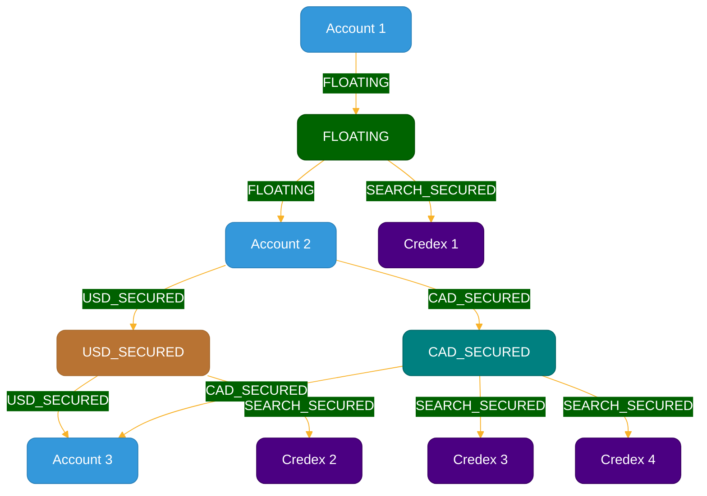

# searchSpace schema

The SearchSpace schema represents a simplified and optimized version of the ledger space, designed for efficient loop finding in the Credex ecosystem. This schema is optimized to facilitate the resource-efficient identification of credloops for the Minute Transaction Queue (MTQ) process.

## Node properties

### Account

- accountID: string
- accountName: string

### SearchAnchor

- searchAnchorID: string
- earliestDueDate: Date

### Credex

- credexID: string
- outstandingAmount: number
- Denomination: string
- CXXmultiplier: number
- dueDate: Date

## Relationship Properties

### FLOATING

- (No properties)

### USD_SECURED, CAD_SECURED

- (No properties)

### SEARCH_SECURED

- (No properties)

## Explanation

1. **Accounts**: Represented by blue nodes, these are simplified versions of the accounts in the ledger space. They contain only essential information needed for loop finding.

2. **SearchAnchors**: These nodes come in three types:

   - FLOATING (dark green): Represent unsecured credit relationships between accounts.
   - USD_SECURED (copper): Represent secured credit relationships in USD.
   - CAD_SECURED (teal): Represent secured credit relationships in CAD.

3. **Credexes**: Shown as dark purple nodes, these represent individual credit transactions in the system.

4. **Relationships**:
   - FLOATING (dark green): Connects accounts to floating SearchAnchors, representing unsecured credit relationships.
   - USD_SECURED (copper): Connect accounts to USD_SECURED SearchAnchors, representing secured credit relationships in USD.
   - CAD_SECURED (teal): Connect accounts to CAD_SECURED SearchAnchors, representing secured credit relationships in CAD.
   - SEARCH_SECURED (dark purple): Links SearchAnchors to Credexes, allowing for efficient traversal during loop finding.

This optimized structure allows the Minute Transaction Queue to quickly identify potential credit loops by traversing the relationships between Accounts, SearchAnchors, and Credexes. The use of SearchAnchors as intermediary nodes between Accounts and Credexes significantly reduces the complexity of loop finding algorithms, enabling faster processing of transactions in the Credex ecosystem.