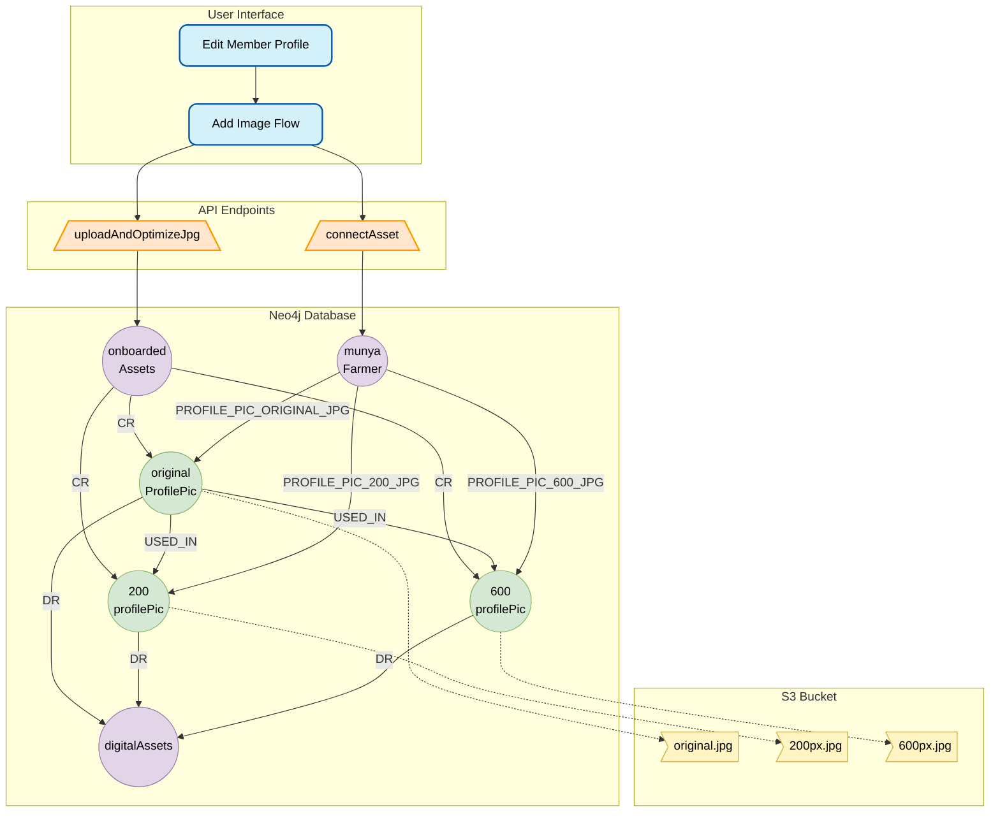
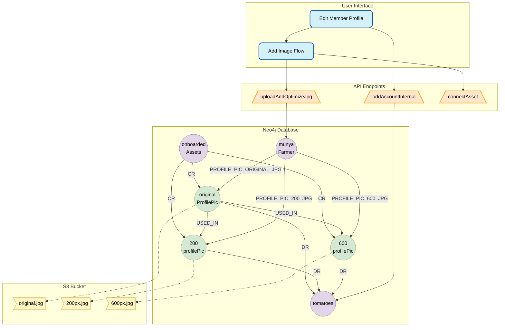
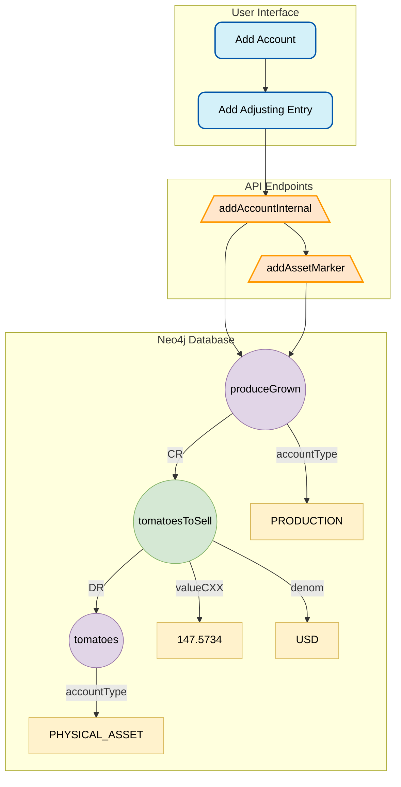

# Vimbiso Market Workplan

Adding marketplace functionality to the VimbisoPay app by extending the underlying accounting infrastructure and client app capabilities.

## Munya the farmer adds a vendor profile pic



## Munya lists tomatoes in the Vimbiso Market



## Munya harvests $100 of tomatoes and tracks with production account (optional step)



## Munya creates an invoice for $20 of tomatoes which are purchased by Farai the merchant

```mermaid

Screens
Vimbiso Store
Display QR
Create Credex from Invoice

Endpoints
/generateInvoice (Munya)
/createCredex (Farai)

Graph
< data coming soon... >
```

## Account Types

### Exchange Accounts (neo4jNode:Account)

- Accounts that exist in searchSpace and can close loops with other accounts.
- Current assets and current liabilities.

#### PERSONAL

- Created with membership, restricted to one per member, one required per member.
- Intended for purchase and sale transactions of goods and services, and the giving and receiving of gifts.

#### OPERATIONS

- Business accounts, shared accounts, etc.
- Can be created by Hustlers and above (pre-release, coming soon for all members).
- Intended for purchase and sale transactions of goods and services, and the giving and receiving of gifts.

#### TRUST

- Audited bank or vault accounts
- Created and managed by Treasurers

### Internal Accounts (neo4jNode:AccountInternal)

- Arbitrary accounts created and managed by members.
- Not added to searchSpace and do not close loops with other accounts.

#### CONSUMPTION (more specific and limited version of Expenses)

Used when an asset's value is consumed by a member, or within an economic process leading to consumption by a member.

#### PRODUCTION (more specific and limited version of Revenue/Income)

Used when value is created or enhanced by a member, or within an economic process directed by members.

#### DIGITAL_ASSET (type of Asset account)

- Real asset who's complete value is stored digitally within the credex ecosystem.
- Can be duplicated at will without altering the original asset.
- Value can be derived without altering the original asset.
- Audit is redundant, data IS the asset.

#### PHYSICAL_ASSET (type of Asset account)

- Identical properties to DIGITAL_ASSET, but what is stored represents underlying real asset that exist in the physical world.
- Underlying assets (and therefore their digital representations) cannot be duplicated or taken from without altering the original asset.
- Value can be derived without altering the original asset.
- Can be audited to confirm that account data matches existing physical asset(s).

## AssetMarker (neo4jNode:AssetMarker)

An AssetMarker is both an Asset and a General Ledger entry.

### As an asset:

If it is a small digital asset or asset marker for a physical asset (up to 2kb?) the asset is stored directly on the node. If it is larger, the node includes a reference to data in an S3 bucket that can only be accessed/decrypted using the data on the AssetMarker node.

### As a General Ledger Entry

Every AssetMarker is connected to one account (:Account|AccountInternal) with a CR (credit) relationship and another account with a DR (debit) relationship.

### USED_IN

An asset is often derived from other assets or processes, indicated by a USED_IN relationship from one AssetMarker to another of from an AccountInternal to an AssetMarker.

```
(:AssetMarker { filename: "profile_pic_original.jpg" })-[:USED_IN]->(AssetMarker { filename: "profile_pic_200.jpg" })
```

### Reference an AssetMarker

Assets can be referenced by custom relationships that will evolve by convention and/or network standard.

```
(:Member|Account|AccountInternal)-[:PROFILE_PIC_200_JPG]->(AssetMarker)
```

## Invoice (neo4jNode::Invoice)

A credex template that directs the creation of the credex and associated accounting entries for the counterparties.

```
(:Account)<-[:DEBITS_TO]-(:Invoice)-[:CREDITS_TO]->(:AccountInternal),
(:Invoice)<-[:EXECUTES]-(:Credex)
```

## Endpoints

### Member

#### /editMember

- firstname: string
- lastname: string
- memberHandle: string
- profile_picture_200_jpg: string // id of node to link with PROFILE_PICTURE_200_JPG relationship
- profile_picture_600_jpg // like above
- rofile_picture_original_jpg // like above
- vendorBio: string

#### /sellInMarket

- set (:Member { vendor: true|false })
- when set to true, creates if not existing:
  - (:accountInternal { accountName: "Onboarded Assets", accountType: "PRODUCTION" })
  - (:accountInternal { accountName: "Profile Pictures", accountType: "DIGITAL_ASSET" })

### Account

#### /editAccount

- accountName: string
- accountHandle: string
- defaultDenom: string // limited to current denoms

#### /createAccountInternal

- accountName: string
- defaultDenom: string // limited to current denoms
- accountType: string // one of CONSUMPTION, PRODUCTION, DIGITAL_ASSET, PHYSICAL_ASSET

#### /editAccountInternal

- accountName: string
- defaultDenom: string // limited to current denoms

#### /deleteAccountInternal

- accountID

### AssetMarker

#### /addAssetMarker

- assetName
- arbitrary key/value pairs and/or neo4j-safed objects up to max size of 2kb(?)
- optional link/key to access any data stored in S3 bucket
- AssetMarkerData: { accountID1: { data for AssetMarker created when a connected credex is accepted, including amount and CR/DR indicator }, accountID2: {data}, ...}

#### /uploadAndOptimizeJpg

- requires jpg, name, DR accountID, optional CR accountID (default MERGE "Onboarded Assets").
- saves AssetMarker with CR and DR relationships
- creates 200px and 600px versions of the above, with the same CR and DR relationships, and a USED_IN relationship from the original upload to the resized/optimized images.

### /connectAsset

- assetID
- connectedID: string // ID of node to connect
- relName: string // currently one of [:USED_IN|PROFILE_PIC_ORIGINAL_JPG|PROFILE_PIC_200_JPG|PROFILE_PIC_600_JPG]

### /disconnectAsset

- assetID
- connectedID: string // ID of node to disconnect
- relName: string // currently one of [:USED_IN|PROFILE_PIC_ORIGINAL_JPG|PROFILE_PIC_200_JPG|PROFILE_PIC_600_JPG]

### /disconnectAsset

- assetID
- connectedID: string // ID of node to disconnect
- relName: string // currently one of [:USED_IN|PROFILE_PIC_ORIGINAL_JPG|PROFILE_PIC_200_JPG|PROFILE_PIC_600_JPG]

## Invoice

### /generateInvoice

- payment accountID: string // Account
- AssetMarkerData: { accountID1: { data for AssetMarker created when a connected credex is accepted }, accountID2: {data}, ...}
- returns link based on invoiceID for client to generate invoiceQR

## Key Vendor Screens

### Edit Member Profile

- Sell in VimbisoMarket toggle, hits /sellInMarket with true|false. When false, all fields below are read-only.
- profile picture
- profile pic add button linking to flow that hits /uploadAndOptimizeJpg then /connectAsset
- firstname, short text
- lastname, short text
- memberHandle, short text
- vendor bio, long text
- Save button, hits /editMember with text fields

### Vimbiso Store

**Open Store and Broadcast Location** button
**Create Credex Invoice** title
Item Amount
Tomatoes fill box
Peanut Butter fill box
Other Account fill box
Up to 10 accounts total
Total $total

**Generate Credex Invoice QR** button hits /generateInvoice
_Manage My Store_ button

### Manage My Store

**Inventory Accounts**<br>
Add and edit accounts for items you sell. Can be single items (eg "2018 Toyota"), or flows of items (eg "Fresh Tomatoes")

- Add Account button
- Adjust Balances button
- List of Accounts and Balances, totalled at the bottom
- Tap an account to view/edit

### Manage Account (add account is basically the same)

**Account Name** with edit button

- Photos with remove/delete buttons that hit /disconnectAsset
- Add photo button linking to flow that hits /uploadAndOptimizeJpg then /connectAsset
- Account/Item Description, long text
- List of most recent 10 transactions in the account
- **Save** button
- _Adjust Balances_ button

### Adjusting Entry

Use to set starting balances, account for spoilage or loss, or any other change in value of inventory assets held.

Credit Accounts | Amount<br>
Tomatoes | fill box<br>
Peanut Butter | fill box<br>
Total Credits | $total<br>

Debit Accounts | Amount<br>
Onboarded Assets | fill box<br>
PRODUCTION accnts | fill box<br>
CONSUMPTION accnts | fill box<br>
Total Debits | $total

Totals must match

**Adjust Account Values** button hits /addAssetMarker
_Back to Accounts_ button

## Purchaser Screens

### Offer Credex

read-only offerCredex screen, with values (including list of accounts and amounts) filled out based on invoice QR scanned
**Offer Credex** button

### Search Screen

Search near me for items, stores, and vendors:

- Search box
- Map box with near me and results
- List of results, clicks to view Item, Store, Vendor pages.

### Store (Account) Page

Account name, photo and description

### Vendor (Member) Page

Name, member role, profile photo and vendorBio
