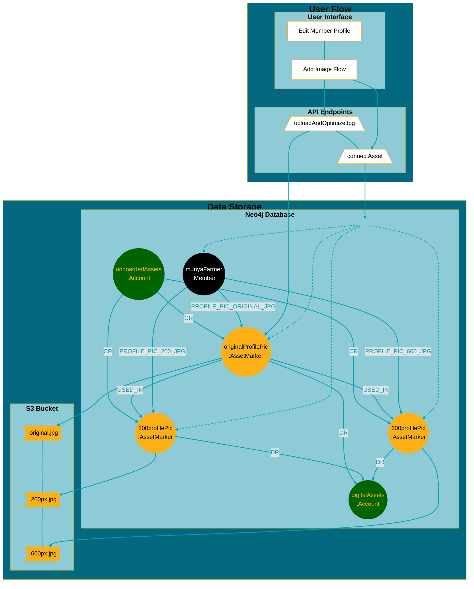
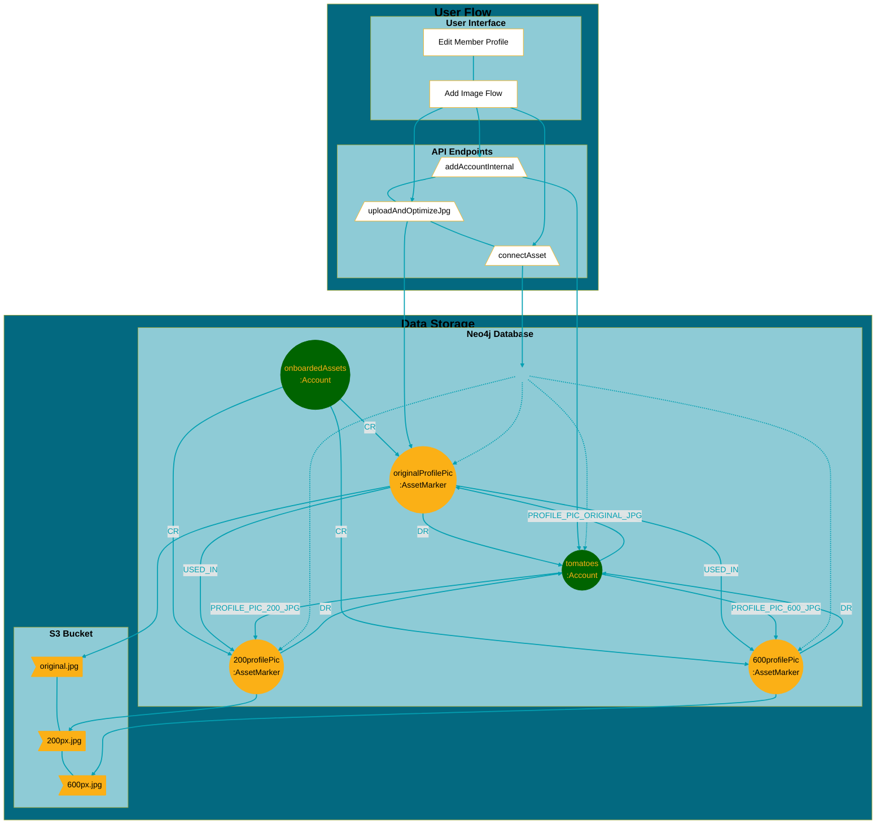
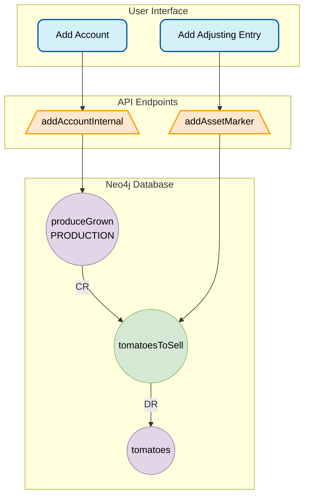
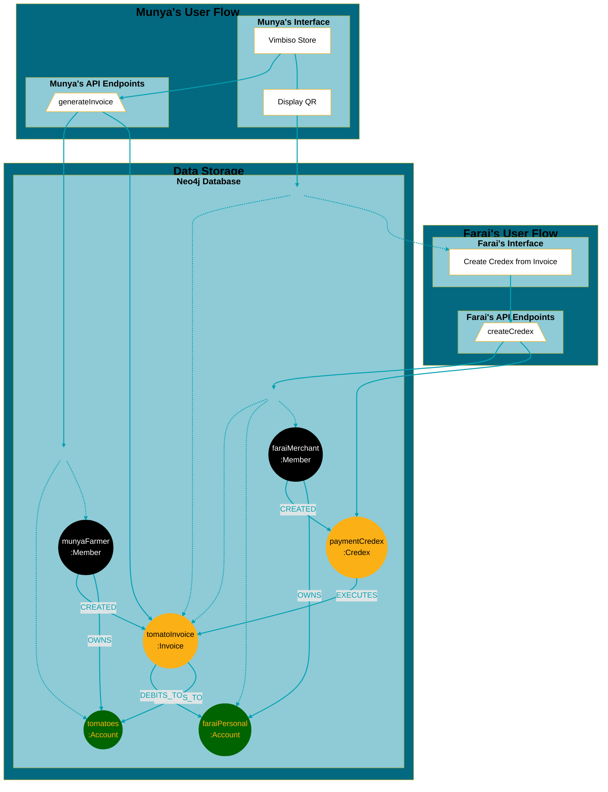

# Vimbiso Market Workplan

Adding marketplace functionality to the VimbisoPay app by extending the underlying accounting infrastructure and client app capabilities.

# Munya the farmer adds a vendor profile pic



# Munya lists tomatoes in the Vimbiso Market



## Munya harvests $100 of tomatoes and tracks with production account (optional step)



## Munya creates an invoice for $20 of tomatoes which are purchased by Farai the merchant



# Data Model Reference

## Account Types

### Exchange Accounts (neo4jNode:Account)

Exchange accounts exist in searchSpace and can close loops with other accounts. They represent current assets and current liabilities.

| Type | Description |
|------|-------------|
| **PERSONAL** | • Created with membership (one per member, required)<br>• For purchase/sale transactions and gifts |
| **OPERATIONS** | • Business accounts, shared accounts<br>• Created by Hustlers and above<br>• For purchase/sale transactions and gifts |
| **TRUST** | • Audited bank or vault accounts<br>• Created and managed by Treasurers |

### Internal Accounts (neo4jNode:AccountInternal)

Internal accounts are created and managed by members but are not added to searchSpace and do not close loops with other accounts.

| Type | Description |
|------|-------------|
| **CONSUMPTION** | • Used when an asset's value is consumed by a member<br>• Or within an economic process leading to consumption |
| **PRODUCTION** | • Used when value is created or enhanced by a member<br>• Or within an economic process directed by members |
| **DIGITAL_ASSET** | • Real asset whose complete value is stored digitally<br>• Can be duplicated without altering the original<br>• Value derived without altering the original<br>• Audit is redundant (data IS the asset) |
| **PHYSICAL_ASSET** | • Digital representation of physical assets<br>• Cannot be duplicated without altering the original<br>• Value derived without altering the original<br>• Can be audited to confirm data matches physical assets |

## AssetMarker (neo4jNode:AssetMarker)

An AssetMarker is both an Asset and a General Ledger entry.

### Dual Nature of AssetMarkers

| As an Asset | As a General Ledger Entry |
|-------------|---------------------------|
| • Small assets (up to 2kb) stored directly on node<br>• Larger assets reference S3 bucket data<br>• S3 data accessed/decrypted using AssetMarker node data | • Connected to one account with CR (credit) relationship<br>• Connected to another account with DR (debit) relationship |

### AssetMarker Relationships

**USED_IN Relationship**
```
(:AssetMarker { filename: "profile_pic_original.jpg" })-[:USED_IN]->(:AssetMarker { filename: "profile_pic_200.jpg" })
```

**Reference Relationships**
```
(:Member|Account|AccountInternal)-[:PROFILE_PIC_200_JPG]->(:AssetMarker)
```

## Invoice (neo4jNode::Invoice)

A credex template that directs the creation of the credex and associated accounting entries for the counterparties.

```
(:Account)<-[:DEBITS_TO]-(:Invoice)-[:CREDITS_TO]->(:AccountInternal),
(:Invoice)<-[:EXECUTES]-(:Credex)
```

# API Reference

## Member Endpoints

### /editMember
Parameters:
- `firstname`: string
- `lastname`: string
- `memberHandle`: string
- `profile_picture_200_jpg`: string - ID of node to link with PROFILE_PICTURE_200_JPG relationship
- `profile_picture_600_jpg`: string - Same as above
- `profile_picture_original_jpg`: string - Same as above
- `vendorBio`: string

### /sellInMarket
Operations:
- Sets `(:Member { vendor: true|false })`
- When set to true, creates if not existing:
  - `(:accountInternal { accountName: "Onboarded Assets", accountType: "PRODUCTION" })`
  - `(:accountInternal { accountName: "Profile Pictures", accountType: "DIGITAL_ASSET" })`

## Account Endpoints

### /editAccount
Parameters:
- `accountName`: string
- `accountHandle`: string
- `defaultDenom`: string - Limited to current denoms

### /createAccountInternal
Parameters:
- `accountName`: string
- `defaultDenom`: string - Limited to current denoms
- `accountType`: string - One of CONSUMPTION, PRODUCTION, DIGITAL_ASSET, PHYSICAL_ASSET

### /editAccountInternal
Parameters:
- `accountName`: string
- `defaultDenom`: string - Limited to current denoms

### /deleteAccountInternal
Parameters:
- `accountID`: string

## AssetMarker Endpoints

### /addAssetMarker
Parameters:
- `assetName`: string
- Arbitrary key/value pairs and/or neo4j-safed objects up to max size of 2kb
- Optional link/key to access any data stored in S3 bucket
- `AssetMarkerData`: Object - Data for AssetMarkers created when a connected credex is accepted

### /uploadAndOptimizeJpg
Parameters:
- Requires jpg, name, DR accountID, optional CR accountID (default MERGE "Onboarded Assets")

Operations:
- Saves AssetMarker with CR and DR relationships
- Creates 200px and 600px versions with the same CR and DR relationships
- Creates USED_IN relationship from original upload to resized/optimized images

### /connectAsset
Parameters:
- `assetID`: string
- `connectedID`: string - ID of node to connect
- `relName`: string - One of [:USED_IN|PROFILE_PIC_ORIGINAL_JPG|PROFILE_PIC_200_JPG|PROFILE_PIC_600_JPG]

### /disconnectAsset
Parameters:
- `assetID`: string
- `connectedID`: string - ID of node to disconnect
- `relName`: string - One of [:USED_IN|PROFILE_PIC_ORIGINAL_JPG|PROFILE_PIC_200_JPG|PROFILE_PIC_600_JPG]

## Invoice Endpoints

### /generateInvoice
Parameters:
- `payment accountID`: string - Account
- `AssetMarkerData`: Object - Data for AssetMarkers created when a connected credex is accepted

Returns:
- Link based on invoiceID for client to generate invoiceQR

# User Interface Specifications

## Vendor Screens

### Edit Member Profile
- **Sell in VimbisoMarket toggle**
  - Hits `/sellInMarket` with true|false
  - When false, all fields below are read-only
- **Profile Information**
  - Profile picture
  - Profile pic add button (triggers `/uploadAndOptimizeJpg` then `/connectAsset`)
  - First name (short text)
  - Last name (short text)
  - Member handle (short text)
  - Vendor bio (long text)
- **Save button** - Hits `/editMember` with text fields

### Vimbiso Store
- **Open Store and Broadcast Location** button
- **Create Credex Invoice** section
  - Item | Amount table
    - Tomatoes | fill box
    - Peanut Butter | fill box
    - Other Account | fill box
    - Up to 10 accounts total
  - Total: $total
- **Generate Credex Invoice QR** button - Hits `/generateInvoice`
- **Manage My Store** button

### Manage My Store
- **Inventory Accounts** section
  - Add and edit accounts for items you sell
  - Can be single items (e.g., "2018 Toyota") or flows of items (e.g., "Fresh Tomatoes")
- **Controls**
  - Add Account button
  - Adjust Balances button
  - List of Accounts and Balances, totaled at the bottom
  - Tap an account to view/edit

### Manage Account
- **Account Name** with edit button
- **Media**
  - Photos with remove/delete buttons (hit `/disconnectAsset`)
  - Add photo button (triggers `/uploadAndOptimizeJpg` then `/connectAsset`)
- **Details**
  - Account/Item Description (long text)
  - List of most recent 10 transactions in the account
- **Controls**
  - **Save** button
  - **Adjust Balances** button

### Adjusting Entry
Use to set starting balances, account for spoilage or loss, or any other change in value of inventory assets held.

| Credit Accounts | Amount |
|-----------------|--------|
| Tomatoes | fill box |
| Peanut Butter | fill box |
| **Total Credits** | $total |

| Debit Accounts | Amount |
|----------------|--------|
| Onboarded Assets | fill box |
| PRODUCTION accounts | fill box |
| CONSUMPTION accounts | fill box |
| **Total Debits** | $total |

*Totals must match*

- **Adjust Account Values** button - Hits `/addAssetMarker`
- **Back to Accounts** button

## Purchaser Screens

### Offer Credex
- Read-only offerCredex screen
- Values (including list of accounts and amounts) filled out based on invoice QR scanned
- **Offer Credex** button

### Search Screen
Search near me for items, stores, and vendors:
- Search box
- Map box with near me and results
- List of results (clicks to view Item, Store, Vendor pages)

### Store (Account) Page
- Account name
- Photo
- Description

### Vendor (Member) Page
- Name
- Member role
- Profile photo
- Vendor bio
