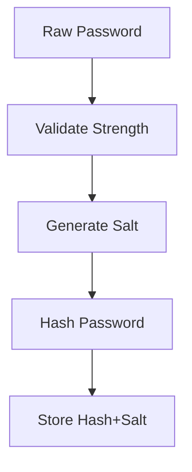

# Password Authentication Implementation Plan

## Overview
Add secure password authentication to member onboarding & existing auth flows while maintaining backward compatibility during transition.

### Implementation Steps

1. **Database Schema Changes**
```cypher
// Add properties to Member nodes
ALTER CONSTRAINT member_node_constraint 
DROP PROPERTIES (id);
ALTER CONSTRAINT member_node_constraint 
ADD PROPERTIES (id, passwordHash, salt, passwordLastChanged);
```

2. **Auth System Modifications**
- Phase 1: Add password to onboarding (optional during transition)
- Phase 2: Enforce password requirement
- Phase 3: Migrate existing members

3. **Password Security Architecture**


4. **API Endpoint Changes**

| Endpoint          | Changes Required                  |
|-------------------|-----------------------------------|
| POST /onboard     | Add password field, hash storage  |
| POST /login       | Add password auth validation      |
| POST /update-pass | New endpoint for password changes |

5. **Service Layer Changes**
a) Modify OnboardMember.ts:
- Add password field to MemberData interface
- Update OnboardMemberService parameters to accept password
- Implement password hashing using bcrypt
- Store hashed password and salt in Member node

b) Create new PasswordService.ts:
- Implement password hashing functionality
- Add password validation rules (complexity requirements)
- Create password update functionality
- Add password reset capabilities (optional future enhancement)

6. **Controller Layer Updates**
a) Update OnboardMemberController:
- Add password field to request validation
- Pass password to OnboardMemberService
- Update API response types

b) Create new UpdatePasswordController:
- Handle password update requests
- Validate current password
- Update to new password
- Return appropriate success/error responses

7. **Authentication Updates**
- Modify authenticate.ts:
  - Update token generation to include password verification
  - Add password verification to authentication middleware
  - Update error handling for password-related failures

8. **Sequence Diagram - Updated Onboarding**
```plaintext
Client->>API: POST /onboard {password,...}
API->>Neo4j: CREATE Member {passwordHash, salt}
Neo4j-->>API: New member
API->>AuthService: Generate JWT
AuthService-->>API: Token
API-->>Client: 201 Created + Token
```

9. **Testing Strategy**
- Unit tests: Password validation & hashing
- Integration tests: Auth flow with error cases
- Load testing: Hash computation performance
- Security tests: OWASP checklist validation

10. **Migration Plan**
```ts
// Temporary dual auth support
const authHandler = (req) => {
  if (req.password) {
    return passwordAuth(req);
  } else {
    return legacyPhoneAuth(req); 
  }
}
```

**Mobile Client Migration Workflow**
1. Mobile client attempts v2 login:
   ```json
   POST /v2/login
   {
     "phone": "+1234567890",
     "password": "existingPassword"
   }
   ```

2. For members without password:
   - Server returns 401 with code "PASSWORD_REQUIRED"
   - Client should prompt user to set initial password

3. Set initial password:
   ```json
   POST /member/set-initial-password
   {
     "phone": "+1234567890",
     "password": "newPassword"
   }
   ```

4. On success:
   - Server returns new auth token with v2/password auth method
   - Client stores token for future requests
   - All subsequent requests use password authentication

11. **Rollback Procedure**
1. Disable password requirement in config
2. Remove password fields from API responses
3. Maintain read compatibility with passwordHash
4. Database rollforward only (keep new columns)

## Security Considerations

1. **Cryptography**
- Use bcrypt with cost factor 12
- Generate 16-byte cryptographically secure salts
- Never store raw passwords
- Hash comparison must be timing-safe

2. **Validation Rules**
```ts
const passwordSchema = z.string()
  .min(10)
  .max(128)
  .regex(/[A-Z]/)
  .regex(/[a-z]/)
  .regex(/[0-9]/)
  .regex(/[^A-Za-z0-9]/);
```

3. **Attack Mitigations**

| Threat                 | Mitigation                        |
|------------------------|-----------------------------------|
| Brute force            | Rate limiting + lockouts          |
| Credential stuffing    | Password history (5 generations)  |
| Hash extraction        | HSMs for prod key management      |
| Timing attacks         | Constant-time comparison          |

## Dependencies

1. **New Packages**
```bash
npm install bcrypt @types/bcrypt zod
```

2. **Configuration Changes**
```env
# Add to .env
PASSWORD_PEPPER="cryptSecureValue"
BCRYPT_COST=12
```

## Documentation Plan

1. **API Docs Updates**
- New request/response fields
- Error codes for password failures
- Deprecation timeline for legacy auth

2. **DevOps Guide**
- Secret rotation procedures
- Disaster recovery for auth system
- Monitoring for auth attempts

3. **Client Integration Guide**
```json
// Example onboarding request
{
  "firstname": "Example",
  "lastname": "User",
  "phone": "+1234567890",
  "password": "SecurePass123!",
  "defaultDenom": "USD"
}
```

## Implementation Order

1. Set up password infrastructure:
   - Install required packages
   - Create PasswordService
   - Add password validation rules

2. Database updates:
   - Add new Member node properties
   - Update constraints
   - Test schema changes

3. Update onboarding flow:
   - Modify OnboardMember service & controller
   - Add password handling
   - Update tests

4. Add password update functionality:
   - Create new endpoint
   - Implement UpdatePasswordController
   - Add validation & security checks

5. Enhance authentication:
   - Update token generation
   - Add password verification
   - Implement dual auth support

6. Testing & Documentation:
   - Complete test coverage
   - Update API documentation
   - Create migration guides

7. Deployment & Monitoring:
   - Staged rollout plan
   - Monitoring implementation
   - Backup & recovery procedures
